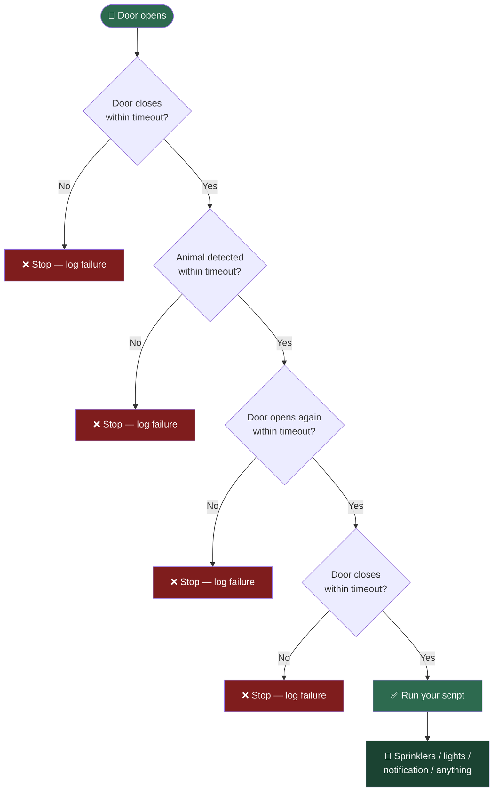

# 🐕 Dog Potty Door-to-Door Automation

Automatically detect a full "let the dog out → she does her business → let
her back in" cycle in Home Assistant, using a door sensor and a camera's
animal detection — then trigger any script you want. Built to dilute dog
urine on the lawn with sprinklers, but works for any "run this after a
confirmed potty trip" use case.

[](https://www.home-assistant.io/)
[](https://www.home-assistant.io/docs/automation/using_blueprints/)
[](LICENSE)

---

## How it works



Every stage has its own timeout, so a false start (opening the door for
something unrelated to a potty trip) won't accidentally fire your script —
the automation just quietly stops and logs why, if you've enabled status
tracking.

---

## Table of contents

- [What's in this repo](#whats-in-this-repo)
- [Prerequisites](#prerequisites)
- [Installation](#installation)
  - [Step 1: Set up the sprinkler script](#step-1-set-up-the-sprinkler-script)
  - [Step 2: Enable animal detection](#step-2-enable-animal-detection-unifi-protect-users)
  - [Step 3: Import the detection automation blueprint](#step-3-import-the-detection-automation-blueprint)
  - [Step 4: Optional helper entities](#step-4-optional-create-helper-entities)
  - [Step 5: Create the automation](#step-5-create-the-automation-from-the-blueprint)
  - [Step 6: Optional dashboard card](#step-6-optional-add-status-to-your-dashboard)
- [Other sprinkler controllers](#other-sprinkler-controllers-not-hydrawise)
- [Troubleshooting](#troubleshooting)
- [Contributing](#contributing)
- [License](#license)

---

## What's in this repo

| File | Type | Purpose |
|---|---|---|
| [`dog_potty_dilution.yaml`](dog_potty_dilution.yaml) | Automation blueprint | Watches the door + camera and runs your script when a full trip is confirmed |
| [`hydrawise_zone_run.yaml`](hydrawise_zone_run.yaml) | Script blueprint | Generates a Hydrawise multi-zone watering script from a simple form |
| `README.md` | Docs | This file |

---

## Prerequisites

- **Home Assistant**, any recent version with blueprint support.
- **A door sensor** exposed as a `binary_sensor` with `device_class: door`
  (a standard Zigbee/Z-Wave contact sensor, or any door/lock integration
  that exposes open/closed state).
- **A camera or sensor that detects animals**, exposed as a `binary_sensor`
  that turns `on` when an animal is seen. This was built and tested with a
  **UniFi Protect** camera (e.g. G6 Bullet) with Animal Detection enabled,
  which the UniFi integration exposes as an `Animal detected` binary
  sensor. Any other integration that exposes a similar sensor works too.
- **A script** that does the thing you actually want to happen once the
  trip is confirmed. Step 1 below covers generating one for Hydrawise, or
  writing a short custom one for other controllers.

---

## Installation

### Step 1: Set up the sprinkler script

[](https://my.home-assistant.io/redirect/blueprint_import/?blueprint_url=https%3A%2F%2Fraw.githubusercontent.com%2FRedBeardBrownEyes%2FDog-Save-the-Lawn%2Fmain%2Fhydrawise_zone_run.yaml)

Click the badge above (once this repo is on GitHub) to import the
**Hydrawise Multi-Zone Watering Run** script blueprint directly, or import
manually:

1. Settings → Automations & Scenes → **Blueprints** tab → **Import
   Blueprint** → paste:
   ```
   https://raw.githubusercontent.com/RedBeardBrownEyes/Dog-Save-the-Lawn/main/hydrawise_zone_run.yaml
   ```
2. Settings → Automations & Scenes → **Scripts** tab → **+ Add Script** →
   **Use a blueprint** → pick "Hydrawise Multi-Zone Watering Run."
3. Fill in:

   | Field | Description | Default |
   |---|---|---|
   | Zones to Water | One or more Hydrawise zone entities, in run order | — |
   | Duration (minutes) | How long each zone runs | 3 |
   | Gap Between Zones (seconds) | Pause between zones | 10 |

4. Save and name it, e.g. **"Back Lawn Post Pee."**

Not on Hydrawise? Jump to [Other sprinkler controllers](#other-sprinkler-controllers-not-hydrawise).

### Step 2: Enable animal detection (UniFi Protect users)

In the UniFi Protect app: **Settings → your camera → Detections → enable
"Animal."** Then in Home Assistant, go to **Settings → Devices & Services →
Entities**, search for your camera, and confirm you have both:

- `binary_sensor.<name>_animal_detected` — the event sensor (turns on when
  an animal is seen). **This is the one you want for Step 5.**
- `binary_sensor.<name>_animal_detection` — a toggle controlling whether
  the feature is enabled. Leave it on, but don't use it as the trigger.

### Step 3: Import the detection automation blueprint

[](https://my.home-assistant.io/redirect/blueprint_import/?blueprint_url=https%3A%2F%2Fraw.githubusercontent.com%2FRedBeardBrownEyes%2FDog-Save-the-Lawn%2Fmain%2Fdog_potty_dilution.yaml)

Click the badge, or import manually:

1. Settings → Automations & Scenes → **Blueprints** tab → **Import
   Blueprint** → paste:
   ```
   https://raw.githubusercontent.com/RedBeardBrownEyes/Dog-Save-the-Lawn/main/dog_potty_dilution.yaml
   ```
2. Preview → Import.

### Step 4: (Optional) create helper entities

Skip this section entirely if you don't want dashboard status tracking or
cooldown protection — the blueprint works fine without either.

| Helper | Type | Purpose |
|---|---|---|
| `Last Sprinkler Run` | `input_datetime` | Enforces a cooldown so back-to-back door trips don't double-trigger |
| `Dog Potty Status` | `input_text` | Live progress + success/failure reason for a dashboard |

Create both via **Settings → Devices & Services → Helpers → Create Helper**.

### Step 5: Create the automation from the blueprint

Settings → Automations & Scenes → **+ Create Automation** → **Use a
blueprint** → **"Dog Potty Door-to-Door Automation."** Then fill in:

| Field | Description | Default |
|---|---|---|
| Door Sensor | Your door's binary sensor | — |
| Animal Detection Sensor | Your camera's animal-detected sensor | — |
| Script to Run | The script from Step 1 (or your custom one) | — |
| Cooldown (seconds) | Minimum gap between runs; `0` disables | 600 |
| Door Close Timeout | How long to wait for the door to close | 2 min |
| Detection / Return Timeout | How long to wait for detection, and separately for the return trip | 20 min |
| Status Helper *(optional)* | From Step 4 | blank |
| Last Run Helper *(optional)* | From Step 4 | blank |

Save.

### Step 6: (Optional) add status to your dashboard

```yaml
type: entities
title: Dog Potty Automation
entities:
  - entity: input_text.dog_potty_status
    name: Status
  - entity: input_datetime.last_sprinkler_run
    name: Last Successful Run
```

---

## Other sprinkler controllers (not Hydrawise)

The Step 1 script blueprint is Hydrawise-specific (`hydrawise.start_watering`).
On a different controller (Rachio, a smart plug, a relay, etc.), write a
short custom script instead — it just needs to turn water on and off:

```yaml
alias: Back Lawn Post Pee
sequence:
  - service: switch.turn_on
    target:
      entity_id: switch.your_zone
  - delay:
      minutes: 3
  - service: switch.turn_off
    target:
      entity_id: switch.your_zone
mode: single
```

Point the **Script to Run** field in Step 5 at whatever script you end up
with. The detection automation doesn't care what's inside — only that it
exists and can be triggered by `script.turn_on`.

---

## Troubleshooting

| Symptom | Likely cause |
|---|---|
| Automation never triggers | Confirm the door sensor's `device_class` is `door` and it flips `off`→`on` on open (check **Developer Tools → States**) |
| Fails with "no animal detected" | Animal detection may be disabled on the camera, the dog may be out of frame, or sensitivity needs tuning in the Protect app |
| Fails with "door never closed" | Timeout too short for how long the door's typically left open — raise **Door Close Timeout** |
| Sprinklers never run even though everything looks right | Check **Cooldown** — if it ran recently, it intentionally skips |
| Automation runs but nothing happens | Confirm the **Script to Run** works standalone: Settings → Automations & Scenes → Scripts → Run |

---

## Contributing

Issues and PRs welcome — especially reports of working entity patterns for
non-UniFi cameras or non-Hydrawise controllers, so this README can list
more tested combinations.

## License

[MIT](LICENSE) — use, modify, and share freely.
