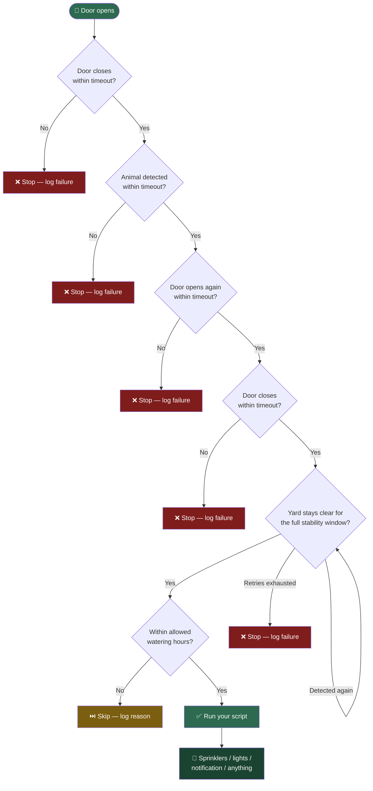

# 🐕 Dog Potty Door-to-Door Automation

Automatically detect a full "let the dog out → she does her business → let
her back in" cycle in Home Assistant, using a door sensor and a camera's
animal detection — then trigger any script you want. Built to dilute dog
urine on the lawn with sprinklers, but works for any "run this after a
confirmed potty trip" use case.

[](https://www.home-assistant.io/)
[](https://www.home-assistant.io/docs/automation/using_blueprints/)
[](LICENSE)

---

## How it works



Every stage has its own timeout, so a false start (opening the door for
something unrelated to a potty trip) won't accidentally fire your script —
the automation just quietly stops and logs why, if you've enabled status
tracking.

There's an extra safeguard after the return door closes: rather than
assuming the trip is over the instant the door closes, the automation
watches the animal sensor (and, optionally, a person sensor) and waits
until it's been **continuously clear for a stability window** — a few
minutes, by default — before running the script. If anything is detected
again during that window, the clock resets and it waits again. This
handles cases the door alone can't: the dog stepping back outside
briefly, a family member still lingering in the garden or on a deck, or
someone using the same door for something unrelated, all without needing
to track how many times the door itself opens and closes.

Optionally, you can also set a **Person Detection Sensor**. If configured,
the same safeguard applies to people too — so if a family member is still
out in the garden or on the deck when the dog comes back in, the
automation waits for them to clear the yard as well before running the
script.

There's also an optional **watering-hours window** (Earliest Run Time /
Latest Run Time). The whole sequence — waiting for detection, the return,
and the stability window — can easily take 20+ minutes, so a trip that
starts in daylight can still finish well after dark. If the script would
run outside your allowed hours, the automation skips it instead of
watering the lawn overnight, since standing water overnight can encourage
fungal growth.

---

## Table of contents

- [What's in this repo](#whats-in-this-repo)
- [Prerequisites](#prerequisites)
- [Installation](#installation)
  - [Step 1: Set up the sprinkler script](#step-1-set-up-the-sprinkler-script)
  - [Step 2: Set up your animal detection sensor](#step-2-set-up-your-animal-detection-sensor)
  - [Step 3: Import the detection automation blueprint](#step-3-import-the-detection-automation-blueprint)
  - [Step 4: Optional helper entities](#step-4-optional-create-helper-entities)
  - [Step 5: Create the automation](#step-5-create-the-automation-from-the-blueprint)
  - [Step 6: Optional dashboard card](#step-6-optional-add-status-to-your-dashboard)
- [Other sprinkler controllers](#other-sprinkler-controllers-not-hydrawise)
- [Troubleshooting](#troubleshooting)
- [Contributing](#contributing)
- [License](#license)

---

## What's in this repo

| File | Type | Purpose |
|---|---|---|
| [`dog_potty_dilution.yaml`](dog_potty_dilution.yaml) | Automation blueprint | Watches the door + camera and runs your script when a full trip is confirmed |
| [`hydrawise_zone_run.yaml`](hydrawise_zone_run.yaml) | Script blueprint | Generates a Hydrawise multi-zone watering script from a simple form |
| `README.md` | Docs | This file |

---

## Prerequisites

- **Home Assistant**, any recent version with blueprint support.
- **A door sensor** exposed as a `binary_sensor` with `device_class: door`
  (a standard Zigbee/Z-Wave contact sensor, or any door/lock integration
  that exposes open/closed state).
- **A camera or NVR that detects animals**, exposed in Home Assistant as a
  `binary_sensor` that turns `on` when an animal is seen. Tested with
  **UniFi Protect** and **Reolink**, and works with **Frigate** or any
  other integration that exposes a similar sensor — see Step 2 for
  platform-specific instructions.
- **A script** that does the thing you actually want to happen once the
  trip is confirmed. Step 1 below covers generating one for Hydrawise, or
  writing a short custom one for other controllers.

---

## Installation

### Step 1: Set up the sprinkler script

[](https://my.home-assistant.io/redirect/blueprint_import/?blueprint_url=https%3A%2F%2Fraw.githubusercontent.com%2FRedBeardBrownEyes%2FDog-Save-the-Lawn%2Fmain%2Fhydrawise_zone_run.yaml)

Click the badge above to import the
**Hydrawise Multi-Zone Watering Run** script blueprint directly, or import
manually:

1. Settings → Automations & Scenes → **Blueprints** tab → **Import
   Blueprint** → paste:
   ```
   https://raw.githubusercontent.com/RedBeardBrownEyes/Dog-Save-the-Lawn/main/hydrawise_zone_run.yaml
   ```
2. Settings → Automations & Scenes → **Scripts** tab → **+ Add Script** →
   **Use a blueprint** → pick "Hydrawise Multi-Zone Watering Run."
3. Fill in:

   | Field | Description | Default |
   |---|---|---|
   | Zones to Water | One or more Hydrawise zone entities, in run order | — |
   | Duration (minutes) | How long each zone runs | 3 |
   | Gap Between Zones (seconds) | Pause between zones | 10 |

4. Save and name it, e.g. **"Back Lawn Post Pee."**

Not on Hydrawise? Jump to [Other sprinkler controllers](#other-sprinkler-controllers-not-hydrawise).

### Step 2: Set up your animal detection sensor

The automation just needs **any `binary_sensor` that turns `on` when an
animal is seen.** It doesn't care which camera brand or integration
provides it. Pick your platform below, or skip to "Finding it yourself"
if you're on something not listed.

<details>
<summary><strong>UniFi Protect</strong></summary>

In the UniFi Protect app: **Settings → your camera → Detections → enable
"Animal."** Then in Home Assistant, go to **Settings → Devices & Services →
Entities**, search for your camera, and confirm you have both:

- `binary_sensor.<name>_animal_detected` — the event sensor (turns on when
  an animal is seen). **Use this one.**
- `binary_sensor.<name>_animal_detection` — a toggle for whether the
  feature is enabled. Leave it on, but don't use it as the trigger.

</details>

<details>
<summary><strong>Reolink</strong></summary>

Reolink's native Home Assistant integration exposes detection sensors per
camera automatically (no separate app setup needed on supported models):

- `binary_sensor.<camera name>_animal` or `binary_sensor.<camera name>_pet`
  — exact name depends on your camera model. **Use whichever one your
  camera exposes.**
- Reolink also exposes `_person`, `_vehicle`, and `_visitor` sensors the
  same way, if you ever want variations on this automation.

</details>

<details>
<summary><strong>Frigate (self-hosted NVR with local object detection)</strong></summary>

Frigate detects objects per camera and exposes a binary sensor per object
type once you've configured it to watch for `dog` (or `cat`) in your
`config.yaml`:

- `binary_sensor.frigate_<camera name>_dog` (or `_cat`, depending on your
  Frigate object config)
- This requires Frigate itself to be set up with an object detector
  (Coral USB TPU, OpenVINO, or CPU) — it's more setup than a
  cloud/camera-native option, but works with almost any RTSP camera and
  runs fully locally.

</details>

<details>
<summary><strong>Finding it yourself (any other platform)</strong></summary>

1. Settings → Devices & Services → **Entities**
2. Search for your camera's name, or search "animal," "pet," or "dog"
3. Look for a `binary_sensor` that changes state (`off` → `on`) when an
   animal walks by — test it by watching **Developer Tools → States**
   while your dog is in frame
4. If your camera/NVR doesn't offer per-species detection at all, it
   likely only supports generic "motion" — that will trigger more false
   positives (squirrels, leaves, etc.) but can still work as a fallback,
   since the door-sequence timeouts will filter out most stray triggers

</details>


### Step 3: Import the detection automation blueprint

[](https://my.home-assistant.io/redirect/blueprint_import/?blueprint_url=https%3A%2F%2Fraw.githubusercontent.com%2FRedBeardBrownEyes%2FDog-Save-the-Lawn%2Fmain%2Fdog_potty_dilution.yaml)

Click the badge, or import manually:

1. Settings → Automations & Scenes → **Blueprints** tab → **Import
   Blueprint** → paste:
   ```
   https://raw.githubusercontent.com/RedBeardBrownEyes/Dog-Save-the-Lawn/main/dog_potty_dilution.yaml
   ```
2. Preview → Import.

### Step 4: (Optional) create helper entities

Skip this section entirely if you don't want dashboard status tracking or
cooldown protection — the blueprint works fine without either.

| Helper | Type | Purpose |
|---|---|---|
| `Last Sprinkler Run` | `input_datetime` | Enforces a cooldown so back-to-back door trips don't double-trigger |
| `Dog Potty Status` | `input_text` | Live progress + success/failure reason for a dashboard |

Create both via **Settings → Devices & Services → Helpers → Create Helper**.

### Step 5: Create the automation from the blueprint

Settings → Automations & Scenes → **+ Create Automation** → **Use a
blueprint** → **"Dog Potty Door-to-Door Automation."** Then fill in:

| Field | Description | Default |
|---|---|---|
| Door Sensor | Your door's binary sensor | — |
| Animal Detection Sensor | Your camera's animal-detected sensor | — |
| Person Detection Sensor *(optional)* | Your camera's person-detected sensor. If set, the automation also waits for the yard to be clear of people, not just the dog, before firing | blank |
| Script to Run | The script from Step 1 (or your custom one) | — |
| Cooldown (seconds) | Minimum gap between runs; `0` disables | 600 |
| Door Close Timeout | How long to wait for the door to close | 2 min |
| Detection / Return Timeout | How long to wait for detection, and separately for the return trip | 20 min |
| Status Helper *(optional)* | From Step 4 | blank |
| Last Run Helper *(optional)* | From Step 4 | blank |
| Yard-Clear Stability Window (minutes) | How long the yard must stay continuously clear of the animal (and person, if set) after the return door closes, before the script runs | 5 |
| Max Stability Retries | Safety cap on how many times the stability window can reset before giving up, in case a sensor flickers indefinitely | 10 |
| Earliest Run Time *(optional)* | Script won't run before this time of day | blank |
| Latest Run Time *(optional)* | Script won't run after this time of day — useful for keeping water off the lawn overnight, which can encourage fungus | blank |

Save.

### Step 6: (Optional) add status to your dashboard

```yaml
type: entities
title: Dog Potty Automation
entities:
  - entity: input_text.dog_potty_status
    name: Status
  - entity: input_datetime.last_sprinkler_run
    name: Last Successful Run
```

---

## Other sprinkler controllers (not Hydrawise)

The Step 1 script blueprint is Hydrawise-specific (`hydrawise.start_watering`).
On a different controller (Rachio, a smart plug, a relay, etc.), write a
short custom script instead — it just needs to turn water on and off:

```yaml
alias: Back Lawn Post Pee
sequence:
  - service: switch.turn_on
    target:
      entity_id: switch.your_zone
  - delay:
      minutes: 3
  - service: switch.turn_off
    target:
      entity_id: switch.your_zone
mode: single
```

Point the **Script to Run** field in Step 5 at whatever script you end up
with. The detection automation doesn't care what's inside — only that it
exists and can be triggered by `script.turn_on`.

---

## Troubleshooting

| Symptom | Likely cause |
|---|---|
| Door Sensor picker shows no entities | Your sensor's `device_class` isn't one the picker looks for (`door`, `garage_door`, `opening`, `window`). Check **Settings → Devices & Services → Entities → your sensor → gear icon → Device class**, and set it to one of those if needed |
| Automation never triggers | Confirm the door sensor actually flips `off`→`on` on open (check **Developer Tools → States**) |
| Fails with "no animal detected" | Animal detection may be disabled on the camera, the dog may be out of frame, sensitivity needs tuning, or you selected the wrong sensor (e.g. a "detection enabled" toggle instead of the actual event sensor — see Step 2) |
| Fails with "door never closed" | Timeout too short for how long the door's typically left open — raise **Door Close Timeout** |
| Sprinklers never run even though everything looks right | Check **Cooldown** — if it ran recently, it intentionally skips |
| Status shows "Skipped - outside allowed watering hours" | Working as intended — the sequence finished outside your **Earliest/Latest Run Time** window and deliberately didn't water. Widen the window if this happens more than you'd like |
| Fails with "yard never cleared" / "yard never cleared of people" | The animal or person sensor never went "off" at all within the detection timeout — check the sensor is working and the camera has a clear view |
| Fails with "yard never stayed clear long enough" | Something keeps getting detected right before the stability window finishes — likely a flickering false detection (a plant moving, a shadow), or the family is genuinely still using the yard. Raise **Max Stability Retries** or shorten the **Stability Window** if this happens often |
| Automation runs but nothing happens | Confirm the **Script to Run** works standalone: Settings → Automations & Scenes → Scripts → Run |

---

## Contributing

Issues and PRs welcome — especially reports of working entity patterns for
non-UniFi cameras or non-Hydrawise controllers, so this README can list
more tested combinations.

## License

[MIT](LICENSE) — use, modify, and share freely.
